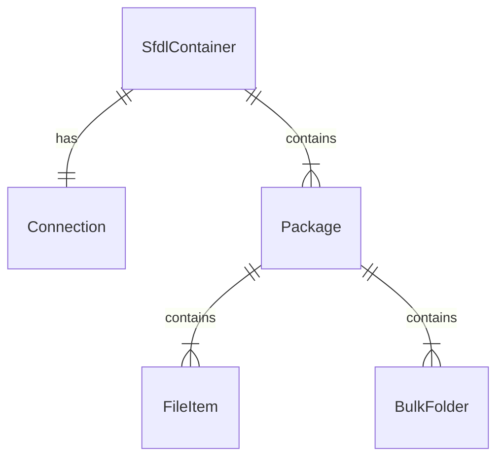
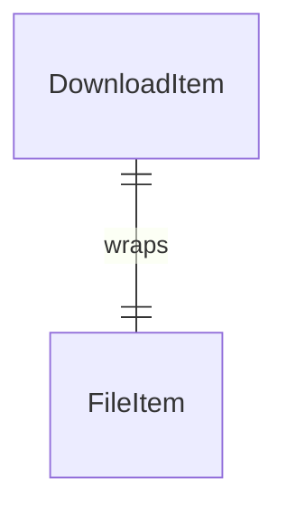

# Entity Model: rsfdl

## SFDL Static Models

### ER-Diagramm



### SfdlContainer

Hauptcontainer mit allen Daten einer SFDL-Datei inkl. Verbindungsinformationen und Paketen.

| Attribute            | Description                  | Rust Type      | Validation Rules         |
|----------------------|------------------------------|----------------|--------------------------|
| container_version    | SFDL-Formatversion (10 = v3) | `u32`          | Required, default: 10    |
| description          | Beschreibung des Containers  | `String`       | Required                 |
| uploader             | Name des Uploaders           | `String`       | Required                 |
| encrypted            | Ob Felder verschlüsselt sind | `bool`         | Required, default: false |
| max_download_threads | Empfohlene parallele Threads | `u32`          | Required, default: 3     |
| connection           | FTP-Verbindungsdaten         | `Connection`   | Required                 |
| packages             | Download-Pakete              | `Vec<Package>` | Required, min 1          |

### Connection

FTP-Verbindungsdaten inkl. Authentifizierung, Encoding und TLS-Konfiguration.

| Attribute            | Description                     | Rust Type               | Validation Rules            |
|----------------------|---------------------------------|-------------------------|-----------------------------|
| host                 | FTP-Hostname                    | `String`                | Required                    |
| port                 | FTP-Port                        | `u16`                   | Required, default: 21       |
| username             | FTP-Benutzername                | `String`                | Required                    |
| password             | FTP-Passwort                    | `String`                | Required                    |
| auth_required        | Ob Authentifizierung nötig ist  | `bool`                  | Required, default: false    |
| data_connection_type | Datenverbindungstyp             | `FtpDataConnectionType` | Required, default: Passive  |
| data_type            | Transfermodus                   | `FtpDataType`           | Required, default: Binary   |
| character_encoding   | Zeichenkodierung                | `CharacterEncoding`     | Required, default: Standard |
| ssl_protocol         | TLS/SSL-Protokoll               | `SslProtocol`           | Required, default: None     |
| connect_timeout      | Verbindungs-Timeout in Sekunden | `u32`                   | Required, default: 10       |
| command_timeout      | Kommando-Timeout in Sekunden    | `u32`                   | Required, default: 10       |

### Package

Download-Paket mit direkten Dateien oder BulkFolder-Referenzen.

| Attribute        | Description                   | Rust Type         | Validation Rules         |
|------------------|-------------------------------|-------------------|--------------------------|
| name             | Paketname                     | `String`          | Required                 |
| bulk_folder_mode | Ob BulkFolder-Modus aktiv ist | `bool`            | Required, default: false |
| file_list        | Direkte Dateiliste            | `Vec<FileItem>`   | Required                 |
| bulk_folder_list | BulkFolder-Referenzen         | `Vec<BulkFolder>` | Required                 |

### FileItem

Einzelne Datei mit Pfad, Grösse und optionalem Hash.

| Attribute      | Description                       | Rust Type  | Validation Rules        |
|----------------|-----------------------------------|------------|-------------------------|
| file_name      | Dateiname                         | `String`   | Required                |
| directory_root | Wurzelverzeichnis auf dem Server  | `String`   | Required                |
| directory_path | Relativer Pfad auf dem Server     | `String`   | Required                |
| full_path      | Vollständiger Pfad auf dem Server | `String`   | Required                |
| file_size      | Dateigrösse in Bytes              | `u64`      | Required, default: 0    |
| hash_type      | Hash-Algorithmus                  | `HashType` | Required, default: None |
| file_hash      | Hash-Wert der Datei               | `String`   | Required                |
| package_name   | Zugehöriges Paket                 | `String`   | Required                |

### BulkFolder

Verzeichnisreferenz für BulkFolder-Modus (wird via FTP-Listing aufgelöst).

| Attribute        | Description                    | Rust Type | Validation Rules |
|------------------|--------------------------------|-----------|------------------|
| bulk_folder_path | Verzeichnispfad auf dem Server | `String`  | Required         |
| package_name     | Zugehöriges Paket              | `String`  | Required         |

---

## Download Runtime Models

### ER-Diagramm



### DownloadItem

Laufzeit-Wrapper um ein FileItem mit lokalem Pfad, Status und Fortschrittsdaten.

| Attribute        | Description                    | Rust Type        | Validation Rules           |
|------------------|--------------------------------|------------------|----------------------------|
| id               | Eindeutige ID                  | `Uuid`           | Required, auto-generiert   |
| file_item        | Gewrapptes SFDL-FileItem       | `FileItem`       | Required                   |
| local_path       | Lokaler Zielpfad               | `PathBuf`        | Required                   |
| status           | Aktueller Download-Status      | `DownloadStatus` | Required, default: Pending |
| bytes_downloaded | Bereits heruntergeladene Bytes | `u64`            | Required, default: 0       |
| error_message    | Fehlermeldung bei Fehler       | `Option<String>` | Optional                   |

### DownloadResult

Zusammenfassung einer abgeschlossenen Download-Session (Rückgabe von `DownloadManager.run()`).

| Attribute   | Description                      | Rust Type | Validation Rules |
|-------------|----------------------------------|-----------|------------------|
| total_files | Gesamtzahl aller Dateien         | `u32`     | Required         |
| completed   | Erfolgreich heruntergeladen      | `u32`     | Required         |
| failed      | Fehlgeschlagen                   | `u32`     | Required         |
| cancelled   | Abgebrochen                      | `u32`     | Required         |
| skipped     | Übersprungen (bereits vorhanden) | `u32`     | Required         |

### ListEntry

Eintrag aus einem FTP-Verzeichnislisting (verwendet bei BulkFolder-Auflösung).

| Attribute    | Description               | Rust Type | Validation Rules |
|--------------|---------------------------|-----------|------------------|
| name         | Datei-/Verzeichnisname    | `String`  | Required         |
| is_directory | Ob es ein Verzeichnis ist | `bool`    | Required         |
| size         | Grösse in Bytes           | `u64`     | Required         |

---

## Settings

### AppSettings

Benutzer-Einstellungen, persistiert als JSON-Datei im plattformspezifischen Config-Verzeichnis.

| Attribute                | Description                           | Rust Type     | Validation Rules                          |
|--------------------------|---------------------------------------|---------------|-------------------------------------------|
| download_directory       | Zielverzeichnis für Downloads         | `PathBuf`     | Required, default: System-Download-Ordner |
| max_download_threads     | Maximale parallele Downloads          | `u32`         | Required, default: 3                      |
| max_retries              | Maximale Wiederholungsversuche        | `u32`         | Required, default: 3                      |
| retry_wait_seconds       | Wartezeit zwischen Retries            | `u32`         | Required, default: 10                     |
| auto_password_list       | Automatisch zu probierende Passwörter | `Vec<String>` | Required, default: leer                   |
| resume_downloads         | Ob Downloads fortgesetzt werden       | `bool`        | Required, default: true                   |
| create_package_subfolder | Unterordner pro Paket erstellen       | `bool`        | Required, default: true                   |
| ftp_timeout_seconds      | FTP-Verbindungs-Timeout               | `u32`         | Required, default: 30                     |
| file_exclusion_patterns  | Glob-Muster für Datei-Ausschluss      | `Vec<String>` | Required, default: leer                   |

### Settings-Persistenz

Settings werden als JSON-Datei im Config-Verzeichnis gespeichert (`~/.config/rsfdl/settings.json` auf Linux, `~/Library/Application Support/rsfdl/settings.json` auf macOS).

```json
{
  "download_directory": "/Users/example/Downloads",
  "max_download_threads": 3,
  "max_retries": 3,
  "retry_wait_seconds": 10,
  "auto_password_list": [
    "pw1",
    "pw2"
  ],
  "resume_downloads": true,
  "create_package_subfolder": true,
  "ftp_timeout_seconds": 30,
  "file_exclusion_patterns": [
    "*.nfo",
    "*.jpg",
    "*sample*"
  ]
}
```

---

## Enumerations

### SfdlVersion

| Wert | Beschreibung                           |
|------|----------------------------------------|
| `V2` | Älteres Format (SFDLFileVersion)       |
| `V3` | Aktuelles Format (ContainerVersion=10) |

### FtpDataConnectionType

| Wert              | Beschreibung                | XML-Alias |
|-------------------|-----------------------------|-----------|
| `Passive`         | PASV (Standard)             | `default` |
| `Active`          | PORT                        | —         |
| `AutoPassive`     | Automatischer Passive-Modus | —         |
| `ExtendedPassive` | EPSV                        | —         |

### FtpDataType

| Wert     | Beschreibung             | XML-Alias |
|----------|--------------------------|-----------|
| `Binary` | Binärtransfer (Standard) | `default` |
| `Ascii`  | ASCII-Transfer           | `ASCII`   |

### CharacterEncoding

| Wert       | Beschreibung     | XML-Alias         |
|------------|------------------|-------------------|
| `Utf8`     | UTF-8 (Standard) | `default`, `UTF8` |
| `Standard` | System-Default   | —                 |
| `Utf7`     | UTF-7            | `UTF7`            |
| `Ascii`    | ASCII            | `ASCII`           |

### SslProtocol

| Wert    | Beschreibung        |
|---------|---------------------|
| `None`  | Kein TLS (Standard) |
| `Tls`   | TLS 1.0             |
| `Tls11` | TLS 1.1             |
| `Tls12` | TLS 1.2             |
| `Ssl2`  | SSL 2.0 (veraltet)  |
| `Ssl3`  | SSL 3.0 (veraltet)  |

### HashType

| Wert   | Beschreibung         | XML-Alias |
|--------|----------------------|-----------|
| `None` | Kein Hash (Standard) | `default` |
| `MD5`  | MD5                  | —         |
| `CRC`  | CRC32                | —         |
| `SHA1` | SHA-1                | —         |

### DownloadStatus

| Wert        | Beschreibung                        |
|-------------|-------------------------------------|
| `Pending`   | Noch nicht gestartet                |
| `Running`   | Download läuft                      |
| `Completed` | Erfolgreich abgeschlossen           |
| `Failed`    | Fehlgeschlagen                      |
| `Cancelled` | Vom Benutzer abgebrochen            |
| `Skipped`   | Datei bereits vollständig vorhanden |

### ResumeAction

| Wert              | Beschreibung                                  |
|-------------------|-----------------------------------------------|
| `StartFresh`      | Download von Anfang an starten                |
| `Resume(u64)`     | Ab Byte-Offset fortsetzen                     |
| `AlreadyComplete` | Datei ist bereits vollständig heruntergeladen |

### ProgressEvent

Events vom Download-Manager an die UI-Schicht (via tokio-Channels).

| Variante       | Felder                                                                      | Beschreibung                           |
|----------------|-----------------------------------------------------------------------------|----------------------------------------|
| `Started`      | item_id: Uuid, file_name: String, total_bytes: u64                          | Download einer Datei gestartet         |
| `BytesWritten` | item_id: Uuid, bytes_delta: u64, total_written: u64                         | Fortschritt einer Datei                |
| `Completed`    | item_id: Uuid                                                               | Datei erfolgreich heruntergeladen      |
| `Skipped`      | item_id: Uuid, file_name: String                                            | Datei übersprungen (bereits vorhanden) |
| `Failed`       | item_id: Uuid, error: String                                                | Datei-Download fehlgeschlagen          |
| `Cancelled`    | item_id: Uuid                                                               | Datei-Download abgebrochen             |
| `AllDone`      | total_files: u32, completed: u32, failed: u32, cancelled: u32, skipped: u32 | Alle Downloads abgeschlossen           |

---

## Error Types

### SfdlError

| Variante                  | Beschreibung                           |
|---------------------------|----------------------------------------|
| `ParseError(String)`      | SFDL-Datei konnte nicht geparst werden |
| `UnsupportedVersion(u32)` | Nicht unterstützte SFDL-Version        |
| `Crypto(CryptoError)`     | Verschlüsselungsfehler                 |
| `Io(std::io::Error)`      | Dateisystem-Fehler                     |

### CryptoError

| Variante                   | Beschreibung                   |
|----------------------------|--------------------------------|
| `DecryptionFailed(String)` | Entschlüsselung fehlgeschlagen |
| `InvalidPassword`          | Ungültiges Passwort            |
| `Base64Error(String)`      | Base64-Dekodierungsfehler      |

### FtpError

| Variante                   | Beschreibung                      |
|----------------------------|-----------------------------------|
| `ConnectionFailed(String)` | Verbindung fehlgeschlagen         |
| `AuthFailed`               | Authentifizierung fehlgeschlagen  |
| `TransferError(String)`    | Transferfehler                    |
| `ListingError(String)`     | Verzeichnislisting fehlgeschlagen |
| `Timeout`                  | Verbindungs-Timeout               |

### DownloadError

| Variante                | Beschreibung                 |
|-------------------------|------------------------------|
| `Ftp(FtpError)`         | FTP-Fehler                   |
| `Io(std::io::Error)`    | Dateisystem-Fehler           |
| `Cancelled`             | Vom Benutzer abgebrochen     |
| `InsufficientDiskSpace` | Nicht genügend Speicherplatz |

---

## Beziehung zu Requirements

| Entity                                                   | Relevante Requirements                                                                     |
|----------------------------------------------------------|--------------------------------------------------------------------------------------------|
| SfdlContainer, Connection, Package, FileItem, BulkFolder | FR-01 (SFDL öffnen), FR-02 (Entschlüsselung), FR-03 (Inhalt anzeigen)                      |
| DownloadItem, DownloadResult, ProgressEvent              | FR-04 (Datei-Auswahl), FR-05 (FTP-Download), FR-06 (Resume), FR-07 (Abbrechen)             |
| AppSettings                                              | FR-02 (Auto-Passwort), FR-11 (Einstellungen persistieren), FR-17 (Datei-Ausschluss-Muster) |
| ListEntry                                                | FR-03 (BulkFolder-Auflösung)                                                               |
| SfdlError, CryptoError                                   | FR-01 (Parsing), FR-02 (Entschlüsselung), NR-06 (Fehlerbehandlung)                         |
| FtpError, DownloadError                                  | FR-05 (Download), FR-10 (Retry-Logik), NR-06 (Fehlerbehandlung)                            |
