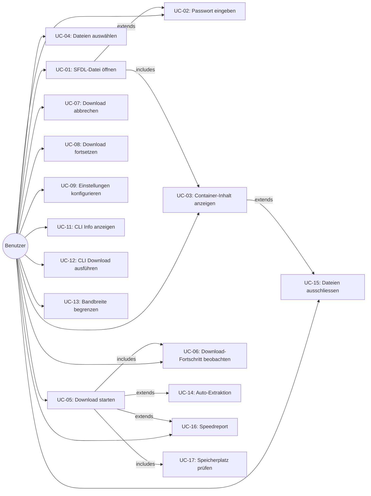

# System Use Cases: rsfdl

## Use Case Diagramm



---

## UC-01: SFDL-Datei öffnen

**Akteur**: Benutzer
**Vorbedingung**: App ist gestartet
**Requirements**: FR-01, FR-02

### Hauptablauf (GUI)
1. Benutzer klickt "Öffnen" oder zieht Datei per Drag-and-Drop
2. System öffnet nativen Datei-Dialog (gefiltert auf `*.sfdl`)
3. Benutzer wählt eine `.sfdl`-Datei
4. System liest Datei und erkennt die Version (v2 oder v3)
5. System parst den XML-Inhalt
6. Wenn `Encrypted=false`: weiter mit UC-03
7. Wenn `Encrypted=true`: weiter mit UC-02

### Hauptablauf (CLI)
1. Benutzer ruft `rsfdl-cli info <datei.sfdl>` auf
2. System liest Datei und erkennt Version
3. System parst XML-Inhalt
4. Wenn verschlüsselt und `-p` angegeben: entschlüsseln
5. Wenn verschlüsselt und kein `-p`: Fehler "Password required"

### Alternativabläufe
- **A1**: Datei existiert nicht → Fehlermeldung "File not found: {path}"
- **A2**: Datei ist kein gültiges XML → Fehlermeldung "Invalid SFDL file"
- **A3**: Unbekannte Version → Fehlermeldung "Unsupported SFDL version"

---

## UC-02: Passwort eingeben

**Akteur**: Benutzer
**Vorbedingung**: Verschlüsselte SFDL-Datei wurde geladen
**Requirements**: FR-02

### Hauptablauf (GUI)
1. System prüft Auto-Passwort-Liste
2. Wenn ein Passwort passt: automatisch entschlüsseln → weiter mit UC-03
3. Wenn kein Passwort passt: Passwort-Dialog anzeigen
4. Benutzer gibt Passwort ein und bestätigt
5. System validiert Passwort (entschlüsselt Host-Feld, prüft auf gültigen Hostnamen)
6. Wenn gültig: alle Felder entschlüsseln → weiter mit UC-03
7. Wenn ungültig: Fehlermeldung, Dialog bleibt offen

### Hauptablauf (CLI)
1. Passwort kommt aus `-p <password>` Parameter
2. System validiert und entschlüsselt
3. Bei Fehler: Exit-Code 1, "Invalid password"

### Alternativabläufe
- **A1**: Benutzer bricht Passwort-Dialog ab → Container wird geschlossen
- **A2**: Passwort mit UTF-8 schlägt fehl → System versucht Latin-1 Encoding

---

## UC-03: Container-Inhalt anzeigen

**Akteur**: Benutzer
**Vorbedingung**: SFDL-Datei ist geparst (und ggf. entschlüsselt)
**Requirements**: FR-03

### Hauptablauf (GUI)
1. System zeigt Container-Header: Beschreibung, Uploader
2. System zeigt Verbindungsinfo: Host, Port, Protokoll (SSL/TLS)
3. System zeigt Paketliste mit Dateien
4. Für jede Datei: Name, Pfad, Grösse
5. Für BulkFolder-Pakete: System verbindet sich zum FTP-Server und listet Verzeichnisse rekursiv auf
6. Gesamtgrösse aller Dateien wird angezeigt

### Hauptablauf (CLI: `info`)
1. System gibt Container-Header auf stdout aus
2. System gibt Verbindungsinfo aus (Host, Port — **keine Credentials**)
3. System gibt Anzahl Pakete und Gesamtdateizahl aus

### Hauptablauf (CLI: `list`)
1. System gibt alle Dateien mit Pfad und Grösse aus
2. Am Ende: Gesamtanzahl und Gesamtgrösse

### Alternativabläufe
- **A1**: BulkFolder-Listing schlägt fehl (Server nicht erreichbar) → Fehlermeldung, BulkFolder als "unresolved" anzeigen

---

## UC-04: Dateien auswählen

**Akteur**: Benutzer
**Vorbedingung**: Container-Inhalt wird angezeigt
**Requirements**: FR-04

### Hauptablauf (GUI)
1. Alle Dateien sind standardmässig ausgewählt
2. Benutzer kann einzelne Dateien per Checkbox abwählen
3. Benutzer kann ganzes Paket per Checkbox an-/abwählen
4. System aktualisiert die angezeigte Gesamtgrösse der Auswahl

### CLI
- In MVP: Alle Dateien werden heruntergeladen (keine Auswahl)
- Später: `--include`/`--exclude` Pattern

---

## UC-05: Download starten

**Akteur**: Benutzer
**Vorbedingung**: Dateien sind ausgewählt, Zielverzeichnis ist gesetzt
**Requirements**: FR-05, FR-06

### Hauptablauf
1. Benutzer klickt "Download" (GUI) oder führt `rsfdl-cli download` aus
2. System prüft Zielverzeichnis (existiert, beschreibbar)
3. System erstellt DownloadSession
4. Für jede ausgewählte Datei: DownloadItem mit Status `Queued`
5. System verbindet sich zum FTP-Server
6. System startet parallele Downloads (max. `max_download_threads`)
7. Pro Datei:
   a. Lokalen Pfad bestimmen (Zielverzeichnis + optional Paket-Subfolder + relativer Pfad)
   b. Prüfen ob Datei bereits existiert und komplett ist → überspringen
   c. Prüfen ob Teildownload vorhanden → Resume ab Offset
   d. FTP RETR starten, Daten streamen, lokal schreiben
   e. Fortschritt melden (Bytes, Speed)
8. Wenn alle fertig → Session-Status: Completed

### Alternativabläufe
- **A1**: FTP-Verbindung schlägt fehl → Fehlermeldung, Retry falls konfiguriert
- **A2**: Zu wenig Speicherplatz → Warnung, Download pausiert
- **A3**: Einzelne Datei schlägt fehl → Datei als `Failed` markieren, andere laufen weiter

---

## UC-06: Download-Fortschritt beobachten

**Akteur**: Benutzer
**Vorbedingung**: Download läuft
**Requirements**: FR-05

### Hauptablauf (GUI)
1. Pro Datei: Fortschrittsbalken, Prozent, aktuelle Geschwindigkeit
2. Global: Gesamtfortschritt, Gesamtgeschwindigkeit, Dateien erledigt/total
3. Anzeige aktualisiert sich in Echtzeit

### Hauptablauf (CLI)
1. Multi-Progress-Bar mit indicatif
2. Pro aktiver Datei: Name, Fortschrittsbalken, Speed
3. Globaler Fortschritt als Zusammenfassung

---

## UC-07: Download abbrechen

**Akteur**: Benutzer
**Vorbedingung**: Download läuft
**Requirements**: FR-07

### Hauptablauf
1. Benutzer klickt "Stop" (GUI) oder drückt Ctrl+C (CLI)
2. System sendet Cancellation-Signal an alle aktiven Downloads
3. Laufende Transfers werden beendet (aktuelle Bytes bleiben erhalten)
4. FTP-Verbindungen werden geschlossen
5. Session-Status: Stopped
6. Bereits geschriebene Bytes bleiben auf Disk (für Resume)

---

## UC-08: Download fortsetzen

**Akteur**: Benutzer
**Vorbedingung**: Es gibt einen abgebrochenen/fehlgeschlagenen Download
**Requirements**: FR-06

### Hauptablauf
1. Benutzer öffnet dieselbe SFDL-Datei erneut
2. System erkennt bestehende lokale Dateien im Zielverzeichnis
3. Für jede Datei: Lokale Grösse mit Remote-Grösse vergleichen
4. Teilweise heruntergeladene Dateien: Resume ab letztem Byte
5. Vollständige Dateien: Überspringen
6. Download startet wie UC-05

---

## UC-09: Einstellungen konfigurieren

**Akteur**: Benutzer
**Vorbedingung**: App ist gestartet
**Requirements**: FR-11

### Hauptablauf (GUI)
1. Benutzer öffnet Einstellungen-Dialog
2. Benutzer kann konfigurieren:
   - Standard-Download-Verzeichnis
   - Max. parallele Downloads (1-10)
   - Max. Retries und Wartezeit
   - Auto-Passwort-Liste verwalten
   - Resume-Verhalten (Resume / Überschreiben)
   - Paket-Unterordner erstellen (ja/nein)
3. Benutzer speichert → System persistiert als JSON-Datei

### Hauptablauf (CLI)
- Einstellungen via Kommandozeilen-Parameter pro Aufruf
- Oder: `rsfdl-cli config set <key> <value>` (Phase 2)

---

## UC-11: CLI Info anzeigen

**Akteur**: Benutzer (Terminal)
**Requirements**: FR-01, FR-02, FR-03

### Hauptablauf
```
$ rsfdl-cli info movie.sfdl -p mypassword

Container: Movie.Release.2026.1080p
Uploader:  username
Version:   10
Encrypted: yes (decrypted)
Server:    ftp.example.com:21 (Plain FTP, Passive)
Packages:  1
Files:     3
Total:     4.2 GB
```

---

## UC-12: CLI Download ausführen

**Akteur**: Benutzer (Terminal)
**Requirements**: FR-05, FR-06, FR-07

### Hauptablauf
```
$ rsfdl-cli download movie.sfdl -p mypassword -d ~/Downloads -t 3

Connecting to ftp.example.com:21...
Downloading 3 files (4.2 GB) to ~/Downloads/Movie.Release.2026.1080p/

[1/3] movie.part1.rar    ████████████████████  100%  12.3 MB/s
[2/3] movie.part2.rar    ██████████░░░░░░░░░░   52%   8.7 MB/s
[3/3] movie.part3.rar    ░░░░░░░░░░░░░░░░░░░░    0%  queued

Total: 2.4/4.2 GB (57%) | Speed: 21.0 MB/s | ETA: 1m 23s
```

---

## UC-13: Bandbreite begrenzen

**Akteur**: Benutzer
**Vorbedingung**: App ist konfiguriert oder Download wird gestartet
**Requirements**: FR-15

### Hauptablauf (GUI)
1. Benutzer öffnet Einstellungen und setzt maximale Download-Geschwindigkeit (KB/s oder MB/s)
2. System speichert den Wert (0 = unbegrenzt)
3. Bei laufendem Download: System verteilt das Limit gleichmässig auf alle aktiven Threads
4. Fortschrittsanzeige zeigt aktuelle (gedrosselte) Geschwindigkeit an

### Hauptablauf (CLI)
1. Benutzer startet Download mit `--max-speed <KB/s>`
2. System begrenzt die Gesamtbandbreite auf den angegebenen Wert
3. Begrenzung wird pro Thread aufgeteilt: `max_speed / aktive_threads`

### Alternativabläufe
- **A1**: Wert 0 oder nicht gesetzt → Keine Begrenzung, volle Geschwindigkeit
- **A2**: Nur 1 Thread aktiv → Gesamtes Limit gilt für diesen Thread

---

## UC-14: Archive automatisch entpacken

**Akteur**: System (automatisch nach Download)
**Vorbedingung**: Alle Dateien eines Pakets sind erfolgreich heruntergeladen, Auto-Extraktion ist aktiviert
**Requirements**: FR-16

### Hauptablauf
1. System erkennt Archiv-Dateien im heruntergeladenen Paket (RAR, ZIP)
2. Bei Multi-Part-RAR: System identifiziert den ersten Teil (`.rar`, `.part01.rar`)
3. System startet Extraktion in das Download-Verzeichnis
4. Fortschritt wird angezeigt (GUI: Fortschrittsbalken, CLI: Progress-Bar)
5. Nach erfolgreicher Extraktion: Optional Archive löschen (wenn in Einstellungen aktiviert)

### Alternativabläufe
- **A1**: Kein Archiv erkannt → Keine Aktion, Download gilt als abgeschlossen
- **A2**: Extraktion schlägt fehl (beschädigtes Archiv) → Fehlermeldung, Archivdateien bleiben erhalten
- **A3**: Passwortgeschütztes RAR → Fehlermeldung "Passwort-geschütztes Archiv"
- **A4**: Feature ist deaktiviert → Keine Extraktion

---

## UC-15: Dateien per Muster ausschliessen

**Akteur**: Benutzer
**Vorbedingung**: Container-Inhalt ist geladen
**Requirements**: FR-17

### Hauptablauf (GUI)
1. System prüft geladene Dateien gegen konfigurierte Ausschluss-Muster
2. Dateien, die einem Muster entsprechen, werden als "übersprungen" markiert
3. Übersprungene Dateien werden in der Dateiliste sichtbar, aber ausgegraut
4. Gesamtgrösse wird ohne übersprungene Dateien berechnet
5. Benutzer kann Muster in den Einstellungen verwalten

### Hauptablauf (CLI)
1. Benutzer kann `--exclude <pattern>` angeben (mehrfach möglich)
2. Muster werden zusätzlich zu den gespeicherten Einstellungen angewandt
3. Ausgeschlossene Dateien werden im Output als "skipped" markiert

### Alternativabläufe
- **A1**: Keine Muster konfiguriert → Alle Dateien werden heruntergeladen
- **A2**: Alle Dateien ausgeschlossen → Warnung "Keine Dateien zum Download", kein Download

---

## UC-16: Speedreport generieren

**Akteur**: Benutzer
**Vorbedingung**: Download eines Containers ist abgeschlossen
**Requirements**: FR-18

### Hauptablauf (GUI)
1. Download aller Dateien ist abgeschlossen (Status: Completed)
2. System generiert BBCode-Report aus konfigurierbarem Template
3. Report wird im Abschluss-Dialog angezeigt
4. Benutzer klickt "Kopieren" → Report in Zwischenablage

### Hauptablauf (CLI)
1. Download ist abgeschlossen
2. Wenn `--speedreport` angegeben: Report wird auf stdout ausgegeben
3. Report enthält: Durchschnittsgeschwindigkeit, Gesamtzeit, Gesamtgrösse, Dateianzahl

### Template-Variablen
- `%%SPEED%%` — Durchschnittsgeschwindigkeit
- `%%TIME%%` — Gesamtdauer (HH:MM:SS)
- `%%SIZE%%` — Gesamtgrösse
- `%%FILES%%` — Anzahl Dateien
- `%%CONNECTION%%` — Host:Port

### Alternativabläufe
- **A1**: Download wurde abgebrochen → Kein Speedreport verfügbar
- **A2**: Kein Template konfiguriert → Standard-Template verwenden

---

## UC-17: Speicherplatz prüfen

**Akteur**: System (automatisch vor Download-Start)
**Vorbedingung**: Benutzer hat Download gestartet (UC-05)
**Requirements**: FR-19

### Hauptablauf
1. Benutzer startet Download (UC-05, Schritt 1)
2. System berechnet benötigten Speicherplatz:
   - Summe aller ausgewählten Dateien
   - Abzüglich bereits teilweise heruntergeladener Bytes
3. System prüft verfügbaren Speicherplatz im Zielverzeichnis
4. Wenn ausreichend: Download startet normal (UC-05, Schritt 3ff.)
5. Wenn unzureichend: Warnung anzeigen

### Hauptablauf bei Warnung (GUI)
1. Dialog: "Zu wenig Speicherplatz: {benötigt} benötigt, {verfügbar} verfügbar"
2. Buttons: "Trotzdem starten" / "Abbrechen"
3. Benutzer entscheidet

### Hauptablauf bei Warnung (CLI)
1. Warnung auf stderr: "Warning: insufficient disk space ({needed} needed, {available} available)"
2. Ohne `--strict-disk-check`: Download startet trotzdem
3. Mit `--strict-disk-check`: Abbruch mit Exit-Code 1

### Alternativabläufe
- **A1**: Zielverzeichnis existiert nicht → Wird erstellt (wie in UC-05)
- **A2**: Speicherplatz kann nicht ermittelt werden → Warnung, Download trotzdem möglich

---

## Use Case Priorisierung

| Use Case | Prio | Phase | Abhängig von |
|---|---|---|---|
| UC-01: SFDL öffnen | MUST | MVP | — |
| UC-02: Passwort eingeben | MUST | MVP | UC-01 |
| UC-03: Inhalt anzeigen | MUST | MVP | UC-01/02 |
| UC-11: CLI Info | MUST | MVP | UC-01/02/03 |
| UC-05: Download starten | MUST | MVP | UC-03 |
| UC-06: Fortschritt | MUST | MVP | UC-05 |
| UC-07: Abbrechen | MUST | MVP | UC-05 |
| UC-08: Resume | MUST | MVP | UC-05 |
| UC-12: CLI Download | MUST | MVP | UC-05 |
| UC-04: Dateien auswählen | SHOULD | MVP | UC-03 |
| UC-09: Einstellungen | SHOULD | P2 | — |
| UC-13: Bandbreite begrenzen | SHOULD | P2 | UC-05 |
| UC-14: Auto-Extraktion | SHOULD | P2 | UC-05 |
| UC-15: Dateien ausschliessen | SHOULD | P2 | UC-03 |
| UC-16: Speedreport | COULD | P2 | UC-05 |
| UC-17: Speicherplatz prüfen | SHOULD | P2 | UC-05 |
