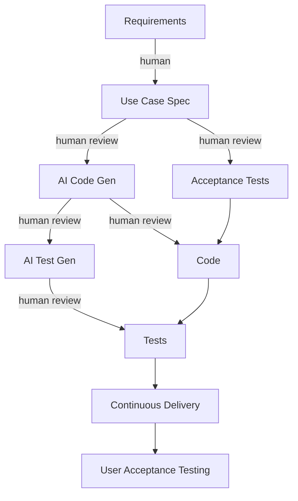

# Development Methodology: AIUP (AI Unified Process)

Based on https://aiup.dev/ by Simon Martinelli.

## Core Principle

Requirements-driven development with AI handling implementation.
Code is generated FROM specifications, not the other way around.
Tests protect behavior consistency across code regeneration cycles.

## Phases for rsfdl

### 1. Inception

- [x] Vision (see docs/vision.md)
- [x] Business Requirements Catalog (see docs/requirements.md)
- [x] Test Strategy (see docs/test-strategy.md)

### 2. Elaboration

- [x] Entity Model with ER diagrams (see docs/entity-model.md)
- [x] System Use Cases (see docs/use-cases.md)
- [x] Acceptance Test Cases (see docs/acceptance-tests.md)

### 3. Construction (per Use Case, iterative)

#### Phase 1 MVP — Complete

- [x] UC-01/02: SFDL Open & Decrypt (spec + code + tests)
- [x] UC-03: Show Container Info (code + tests)
- [x] UC-05: FTP Download (code + 9 integration tests)
- [x] UC-06: Progress Display (CLI indicatif + GUI throttled)
- [x] UC-07: Cancel Download (CancellationToken, CLI + core)
- [x] UC-08: Resume Downloads (REST byte-offset + 2 tests)
- [x] UC-11: CLI Info/List (spec + code + E2E tests)
- [x] UC-12: CLI Download (code + 4 E2E tests)

#### Phase 2 — In Progress

- [x] UC-15: File Exclusion Patterns (spec + code + 20 unit tests + CLI + GUI integration)
- [x] UC-14: Auto-Extraction (spec + code + 72 tests + CLI integration, GUI events deferred)
- [x] UC-04: File Selection (GUI implementation complete: per-file/package/all checkboxes, size display, download filtering; no automated tests — GUI-only)
- [x] UC-18: SFDL Creator — Serialize (serialize_v3 + round-trip tests AT-34, AT-35)
- [x] UC-19: SFDL Creator — Encrypt (encrypt_string, encrypt_container + round-trip tests AT-36, AT-37, AT-38)
- [x] SFDL Creator GUI (Creator View with form, BulkFolder/FileList modes, save dialog)
- [ ] UC-09: Settings Persistence (schema defined, not integrated)
- [ ] UC-13: Bandwidth Limiting
- [ ] UC-16: Speedreport
- [ ] UC-17: Disk Space Check
- [ ] GUI automated tests (zero coverage)

#### Phase 3 (deferred)

- [ ] FR-08: FTPS/TLS support
- [ ] FR-09: Hash verification (server-side)
- [ ] FR-10: Granular retry logic
- [ ] FR-13: Drag-and-drop
- [ ] FR-14: File association

### 4. Transition

- [ ] User Acceptance Testing
- [ ] Continuous Delivery setup
- [ ] Production optimization

## Workflow per Feature

## Adapted for Rust/Dioxus (no Vaadin/jOOQ)

| AIUP Step            | Our Equivalent                            |
|----------------------|-------------------------------------------|
| Requirements         | docs/requirements.md                      |
| Entity Model         | docs/entity-model.md (Mermaid ER diagram) |
| Use Case Diagram     | docs/use-cases.md (PlantUML or Mermaid)   |
| Settings Persistence | JSON file via core/src/settings.rs        |
| Use Case Spec        | docs/specs/UC-{nn}-{name}.md              |
| Implementation       | AI generates Rust code from spec          |
| Unit Tests           | cargo test (per use case)                 |
| Integration Tests    | CLI E2E tests                             |

## Detailed Use Case Specifications

| Spec                                         | Status     |
|----------------------------------------------|------------|
| docs/specs/UC-01-02-sfdl-open-decrypt.md     | ✅ Complete |
| docs/specs/UC-11-cli-info-list.md            | ✅ Complete |
| docs/specs/UC-03-container-display.md        | ✅ Complete |
| docs/specs/UC-04-file-selection.md           | ✅ Complete |
| docs/specs/UC-05-06-07-08-download-engine.md | ✅ Complete |
| docs/specs/UC-09-settings.md                 | ✅ Complete |
| docs/specs/UC-12-cli-download.md             | ✅ Complete |
| docs/specs/UC-15-file-exclusion.md           | ✅ Complete |
| docs/specs/UC-14-auto-extraction.md          | ✅ Complete |
| docs/specs/UC-18-19-sfdl-creator.md          | ✅ Complete |

## Test Coverage (current)

| Level           | Count   | Scope                                                                                                                               |
|-----------------|---------|-------------------------------------------------------------------------------------------------------------------------------------|
| Unit tests      | 149     | Crypto (encrypt+decrypt), parser (serialize+parse), builder, models, filter, download, errors, extraction (detector, rar, zip, mod) |
| Integration     | 6       | Parse + decrypt + serialize pipeline                                                                                                |
| FTP integration | 9       | Download manager (feature-gated)                                                                                                    |
| CLI E2E         | 11      | info, list, download commands                                                                                                       |
| GUI             | 0       | Manual testing only                                                                                                                 |
| **Total**       | **166** | (+ 9 FTP behind feature gate)                                                                                                       |

## Six Principles (applied)

1. **Requirements-Driven**: Specs first, code follows
2. **AI-Assisted**: AI generates code + tests from specs
3. **Iterative**: Short cycles, improve specs and code together
4. **Test-Protected**: Tests ensure behavior on code regeneration
5. **Stakeholder-Centric**: Continuous validation by user
6. **Traceable**: Each piece of code traces back to a use case/requirement
